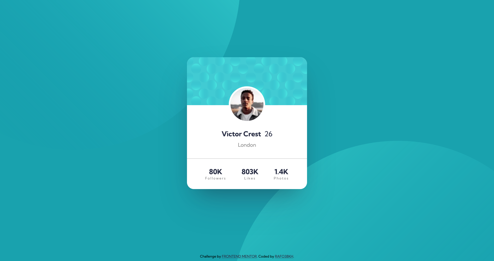

# Frontend Mentor - Profile Card Component Solution

This is a solution to the [Profile Card Component Challenge on Frontend Mentor](https://www.frontendmentor.io/challenges/profile-card-component-cfArpWshJ)

## Table of contents

- [Overview](#overview)
  - [The challenge](#the-challenge)
  - [Screenshot](#screenshot)
  - [Links](#links)
- [My process](#my-process)
  - [Built with](#built-with)
- [Author](#author)

## Overview

### The challenge

- Build out the project to the designs provided

### Screenshot

### Links

- Solution URL: [https://www.frontendmentor.io/solutions/profile-card-component-with-scss-bem-and-css-flexbox-qyhqVqEpw](https://www.frontendmentor.io/solutions/profile-card-component-with-scss-bem-and-css-flexbox-qyhqVqEpw)
- Live Site URL: [https://rafo38kh.github.io/profile-card-component-main/](https://rafo38kh.github.io/profile-card-component-main/)

## My process

### Built with

- Semantic HTML5 markup
- SCSS custom properties
- CSS Flexbox
- Mobile-first workflow

## Author

- Frontend Mentor - [@rafo38kh](https://www.frontendmentor.io/profile/rafo38kh)
- GitHub - [@rafo38kh](https://github.com/rafo38kh)
- Codewars - [@rafo38kh](https://www.codewars.com/users/rafo38kh)
